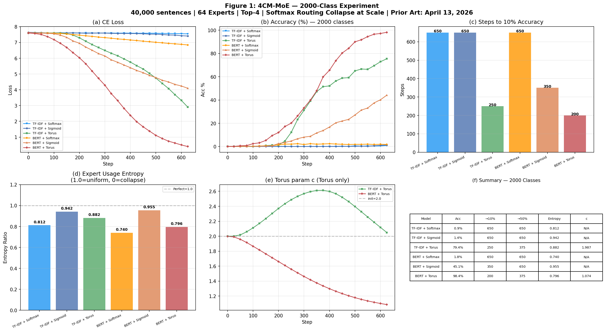
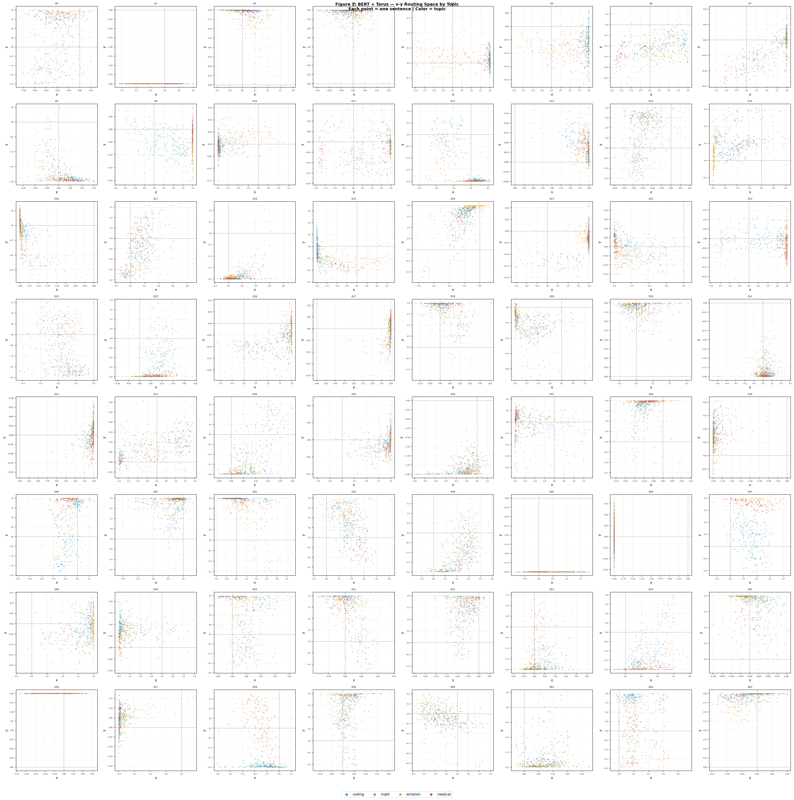

# 4CM-MoE

MoE Router using 4CM Torus Function — replacing sigmoid to prevent Routing Collapse.

**First Public Release:** 2026-04-13  
**Last Updated:** 2026-04-15

## Motivation

| Model | Router Activation |
|---|---|
| Switch Transformer | Softmax |
| Mixtral | Softmax |
| DeepSeek-V3 | Sigmoid |
| ReMoE (2024) | ReLU |
| **4CM-MoE (2026)** | **Torus (2D, learnable)** |

This project aims to **innovate the MoE router itself**.

## What is 4CM?

4CM (4 Councilmen Model) is a multi-agent framework
based on orthogonal agent design and torus mathematics.

The Torus function was originally designed as a mathematical space
where 4 orthogonal agents converge to consensus.
This project applies the same function as an activation function
in MoE Router, replacing sigmoid (DeepSeek-V3) to prevent Routing Collapse.

→ GitHub: https://github.com/Klastrovanie/4councilmen  
→ ACM Digital Library: https://dl.acm.org/doi/book/10.5555/2231522

## Torus Function

**Original 4CM Torus (PhD Dissertation, 2011):**

$$
f(x, y) = \left[(x+a)^{a_1} + (y+b)^{b_1}\right] e^{-(x^c + y^d)}
$$

**MoE Adaptation (this work):**

$$
x = \tanh(u_t^{\top} E_i^{x}) \cdot \alpha, \quad y = \tanh(u_t^{\top} E_i^{y}) \cdot \alpha
$$

$$
s_{i,t} = \left[|x|^{a_1} + |y|^{b_1}\right] e^{-(|x|^c + |y|^d)} + b_i
$$

where:
- $u_t$ : hidden state (split into two halves)
- $E_i^x, E_i^y$ : learnable expert centroid vectors
- $\alpha = 2.0$ : scale, normalizes input to (-2, +2)
- $b_i$ : learnable bias per expert
- $a_1, b_1, c, d$ : learnable torus shape parameters

Modifications from original:
- Position shifts $a, b$ removed → symmetric routing
- $\tanh$ projection added → normalizes input to $(-2, +2)$ range
- Absolute value added → handles negative affinity scores
- Bias $b_i$ added per expert → learnable offset
- Parameters $a_1, b_1, c, d$  made learnable via `nn.Parameter`

## Key Results

2000-class experiment | 40,000 sentences | 64 experts | Top-4

| Model | Acc | Steps→10% | Entropy | c final |
|---|---|---|---|---|
| TF-IDF + Softmax | 0.9% ❌ | 650 | 0.812 | N/A |
| TF-IDF + Sigmoid | 1.4% ❌ | 650 | 0.942 | N/A |
| TF-IDF + Torus | 79.4% ✅ | 250 | 0.882 | 1.987 |
| BERT + Softmax | 1.8% ❌ | 650 | 0.740 | N/A |
| BERT + Sigmoid | 45.1% ⚠️ | 350 | 0.955 | N/A |
| **BERT + Torus** | **98.4% ✅** | **200** | **0.796** | **1.074** |

> Softmax exhibits Routing Collapse at scale — low entropy due to expert monopolization, not specialization.
> TorusRouter achieves 98.4% accuracy with meaningful expert specialization (Entropy 0.796).



## x-y Routing Space (Figure 2)

TorusRouter projects hidden states into 2D space.
Each subplot = one Expert | Color = topic



## Quick Start

```bash
pip install torch transformers scikit-learn matplotlib numpy
```

```bash
# Small scale (40 sentences | 8 experts)
bash run.sh

# 2000 classes | 40,000 sentences | Softmax vs Sigmoid vs Torus
python compare_2000class.py
```

## Prior Art
First public release: April 13, 2026  
Based on: the Torus function from PhD Dissertation, 2011 (ACM Digital Library: https://dl.acm.org/doi/book/10.5555/2231522) 

## License

AGPL v3 — free for research and non-commercial use.  
Commercial use requires a separate agreement.

This code is released to encourage collaboration across AI systems — not competition.  
The goal is shared solutions, not shared resources.

For commercial licensing: leave a message on [Discussions](../../discussions)

## Copyright

Copyright © 2026 Klastrovanie Co., Ltd. All rights reserved.
