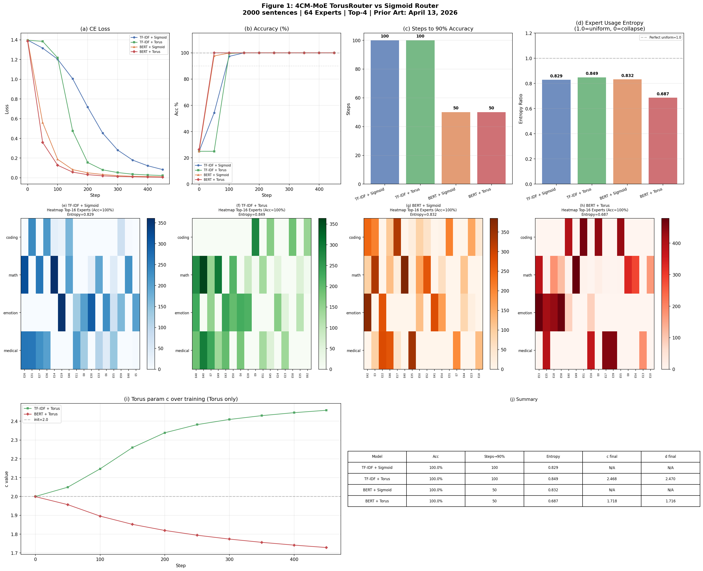

# 4CM-MoE

MoE Router using 4CM Torus Function — replacing sigmoid to prevent Routing Collapse.

**First Public Release:** 2026-04-13  
**Last Updated:** 2026-04-13

## Motivation

| Model | Router Activation |
|---|---|
| Switch Transformer | Softmax |
| Mixtral | Softmax |
| DeepSeek-V3 | Sigmoid |
| ReMoE (2024) | ReLU |
| **4CM-MoE (2026)** | **Torus (2D, learnable)** |

This project aims to **innovate the MoE router itself**.

## What is 4CM?

4CM (4 Councilmen Model) is a multi-agent framework
based on orthogonal agent design and torus mathematics.

The Torus function was originally designed as a mathematical space
where 4 orthogonal agents converge to consensus.
This project applies the same function as an activation function
in MoE Router, replacing sigmoid (DeepSeek-V3) to prevent Routing Collapse.

→ GitHub: https://github.com/Klastrovanie/4councilmen  
→ ACM Digital Library: https://dl.acm.org/doi/book/10.5555/2231522

## Torus Function

**Original 4CM Torus (PhD Dissertation, 2011):**

$$
f(x, y) = \left[(x+a)^{a_1} + (y+b)^{b_1}\right] e^{-(x^c + y^d)}
$$

**MoE Adaptation (this work):**

$$
f(x, y) = \left[|x|^{a_1} + |y|^{b_1}\right] e^{-(|x|^c + |y|^d)}
$$

Modifications from original:
- Position shifts $a, b$ removed → symmetric routing
- Absolute value added → handles negative affinity scores
- Parameters $a_1, b_1, c, d$ made learnable via `nn.Parameter`

## Key Results

| Model | Acc | Steps→90% | Entropy | c final |
|---|---|---|---|---|
| TF-IDF + Sigmoid | 100% | 100 | 0.829 | N/A |
| TF-IDF + Torus | 100% | 100 | 0.849 | 2.468 |
| BERT + Sigmoid | 100% | 50 | 0.832 | N/A |
| BERT + Torus | 100% | 50 | **0.687** | 1.718 |



## Quick Start

```bash
pip install torch transformers scikit-learn matplotlib numpy
```

```bash
# Small scale (40 sentences | 8 experts)
bash run.sh

# Large scale (2000 sentences | 64 experts)
python compare_all_2k.py
```

## Prior Art
First public release: April 13, 2026
Based on: PhD Dissertation, 2011

## License

AGPL v3 — free for research and non-commercial use.  
Commercial use requires a separate agreement.

This code is released to encourage collaboration across AI systems — not competition.  
The goal is shared solutions, not shared resources.

For commercial licensing: leave a message on [Discussions](../../discussions)

## Copyright

Copyright © 2026 Klastrovanie Co., Ltd. All rights reserved.
